+++
date = '2025-02-02T18:41:18-03:00'
draft = false
title = 'Primeiros Passos na Meu Bolso'
image = 'mike-hindle-ppkTc8mp8ZE-unsplash.jpg'
+++

# Sobre o que é este artigo

Esse artigo vai ser um passo a passo sobre o que fazer para gerenciar suas finanças na aplicação Meu Bolso. Isso serve como um guia para explicar os principais processos, mas também serve como uma demonstração sobre o que você vai conseguir como produto ao utilizar o sistema.

# Configuração da conta

O primeiro passo é realizar o login. Ao acessar a aplicação em https://meubolso.lucasmaia.dev, você vai ser direcionado para a página inicial de acesso, onde poderá clicar em “Fazer login com o google”. É necessário possuir uma conta google para fazer o login e aceitar compartilhar algumas informações como nome e email para prosseguir.

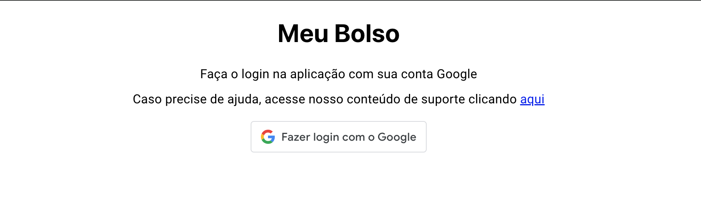

Ao realizar o login, você será direcionado para a página inicial, com seu Dashboard, mas perceba que existe uma mensagem em azul informando que você ainda não possui contabilidades calculadas para esse período. Você precisa incluir informações de transações ou patrimônios para que uma contabilidade seja calculada e possa aparecer na tela de dashboard. Faremos esse cadastro logo mais. Primeiramente, é necessário cadastrar as contas que você possui.

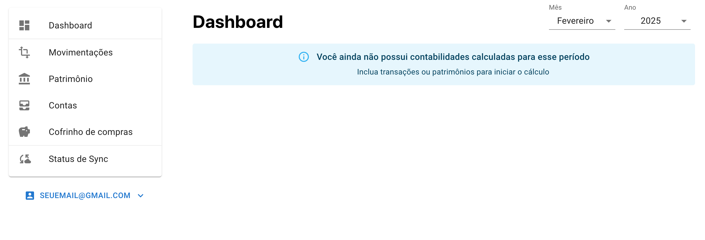

Para cadastrar suas contas, acesse a opção Contas no menu lateral. Para o nosso exemplo, vamos considerar que temos 3 contas: uma conta no Banco A, uma conta no Banco B, e uma conta em uma corretora chamada Corretora A. Para iniciar o cadastro dessas contas, clique no botão “Criar nova conta” que aparece no lado direito da tela. Um modal será aberto e você poderá incluir o nome da nova conta, e seu tipo. Vamos cadastrar as contas bancárias como sendo de depósito e a conta da corretora como uma conta de investimento.

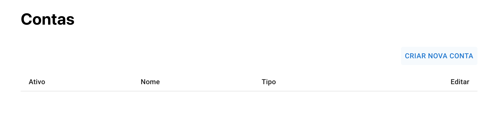

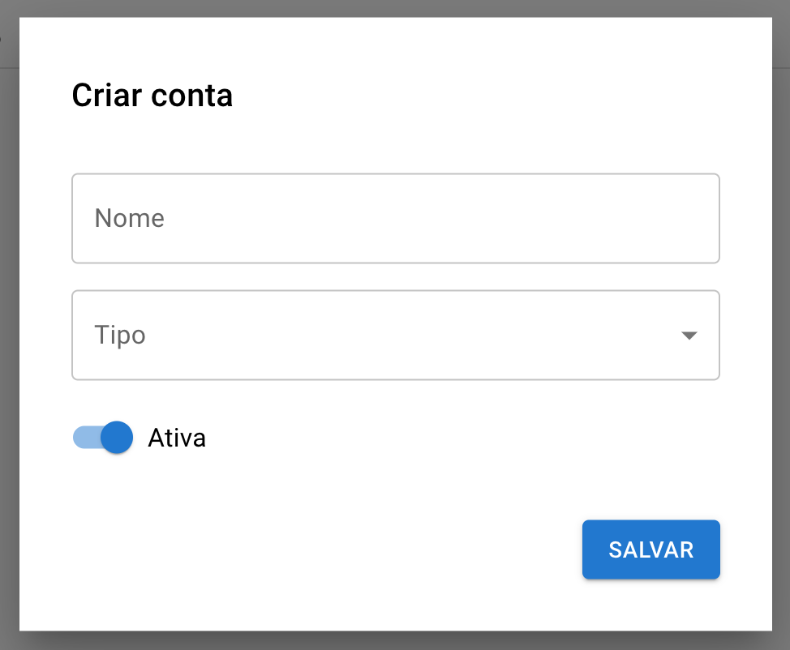

No fim, você verá a lista preenchida na sua página de Contas.

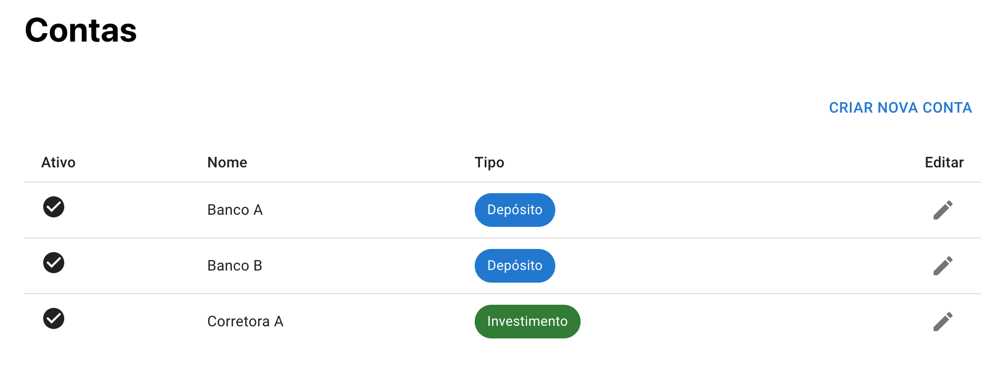

# Realizando o cadastro do seu primeiro mês

Geralmente, os cálculos de contabilidade possuem valores comparativos, como o aumento mensal do seu patrimônio. No primeiro mês, esses valores não poderão ser calculados, mas vamos realizar os cadastros para que possamos visualizar a primeira contabilidade sendo calculada. Nesse exemplo, nosso primeiro mês será Janeiro de 2025. Vamos iniciar cadastrando os valores que possuímos em patrimônio em cada uma das contas que cadastramos no passo anterior. Para isso, vamos acessar a página de Patrimônio. Como vamos cadastrar o mês de Janeiro, temos que nos certificar que o período correto está selecionado no seletor de períodos no canto superior direito da tela. Parecido com o que fizemos para nossas contas, vamos clicar no botão “Criar novo registro de patrimônio” e preencher o formulário do modal que aparece.

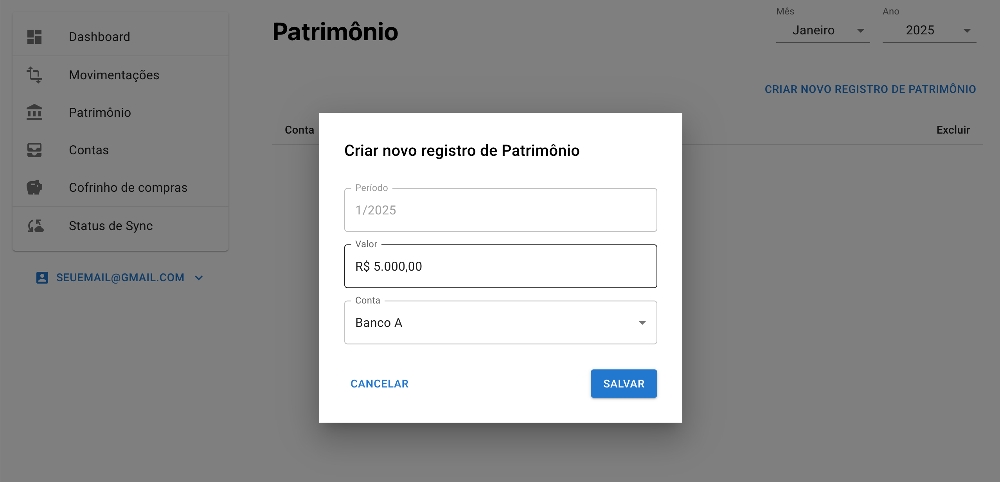

Vamos assumir para nosso exemplo que possuímos 5000 reais na conta do Banco A, 5000 na conta do Banco B e 3000 na conta da Corretora A. Registrando esses patrimônios corretamente teremos no fim nossa lista de registros de Janeiro.

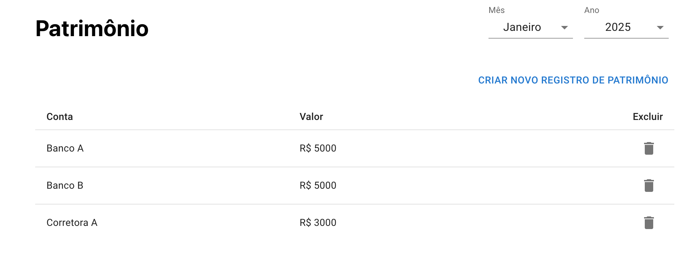

Além dos patrimônios, é necessário incluir suas movimentações. Nesse primeiro mês, não precisamos inserir muitas transações, já que elas servem para calcular alguns valores de economia, mas, para que esses valores sejam calculados, precisamos da contabilidade do mês anterior, porque possuem uma característica comparativa. Vamos no nosso exemplo apenas cadastrar o valor do nosso salário, que será de R$3000. De maneira similar ao Patrimônio, vamos acessar a tela de Movimentações e clicar em “Criar nova movimentação”. Vamos precisar incluir o valor de 3000, a conta associada, que será a “Banco A”, e o tipo de movimentação, que no nosso caso será “Salário”. No fim, teremos também uma lista de Movimentações. Preste atenção se o período correto está selecionado no topo superior direito.

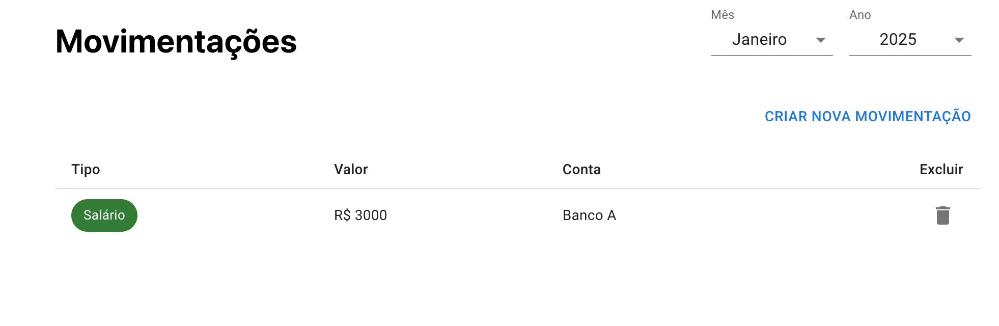

Agora, se acessarmos a página de Dashboard e escolhermos o período correto, vamos perceber que o sistema realizou o cálculo da nossa primeira contabilidade.

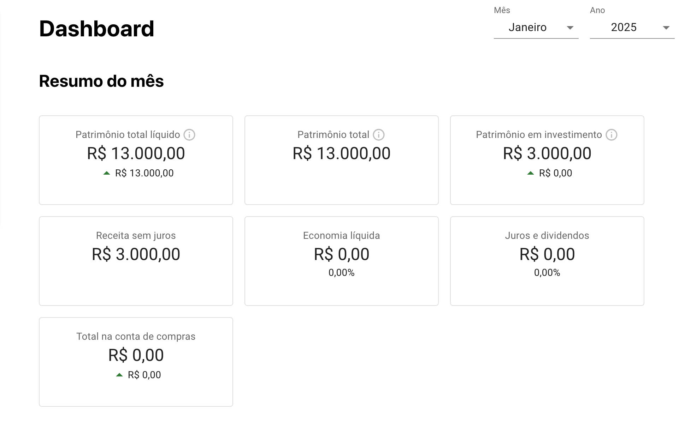

Os cálculos parecem corretos. Temos R$13000 guardado nas nossas 3 contas, sendo R$3000 em contas do tipo Investimento, e tivemos uma receita de R$3000, que foi nosso salário. Os valores de economia e Juros e dividendos serão calculados nos meses subsequentes, pois, como comentado anteriormente, precisam da contabilidade do mês anterior. A conta de compras também foi algo que não comentamos ainda, mas vamos cadastrar novas movimentações nessas contas no próximo mês.

# Realizando o cadastro do segundo mês

Para o exemplo do segundo mês, vamos considerar o seguinte cenário: no fim do mês de Fevereiro de 2025, temos agora R$6000 no saldo da conta do Banco A. O saldo da conta do Banco B permanece igual, com R$5000, e temos um saldo de R$3150 na Corretora A. Não é necessário cadastrar todas as transações que temos nas nossas contas de depósito, mas durante esse mês, transferimos R$100 para nossa corretora, para comprar um título de Tesouro Direto, então vamos criar uma nova transação para essa conta do tipo “Depósito”. Transações de depósitos e retiradas de contas de investimento precisam ser cadastradas para o cálculo correto dos Juros. Se fizermos os cadastros desses patrimônios e movimentações, no fim vamos ter nossas listas do mês de Fevereiro.

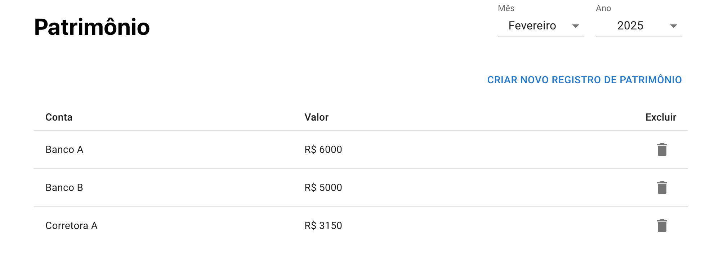

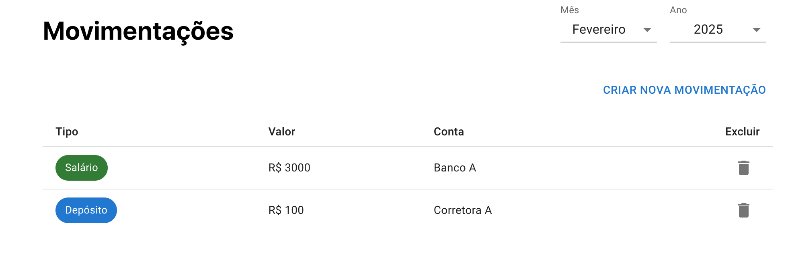

Perceba que nas movimentações nós novamente cadastramos o nosso salário de R$3000.

Agora, vamos supor que temos um plano de fazer uma viagem no fim do ano e queremos reservar R$50 por mês para passagem. O ideal é criar essa reserva mês a mês usando, para isso, nosso cofrinho de compras. Se não cadastramos transações em um mês, o sistema vai supor que o saldo do cofrinho é igual ao do mês anterior.

Então, igual como fizemos com patrimônios e movimentações, vamos acessar a página de Cofrinho de compras para cadastrar uma nova movimentação de compra do tipo “Depósito” no valor de R$50.

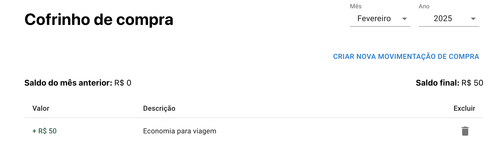

Agora, vamos dar uma olhada em como está nossa contabilidade do mês.

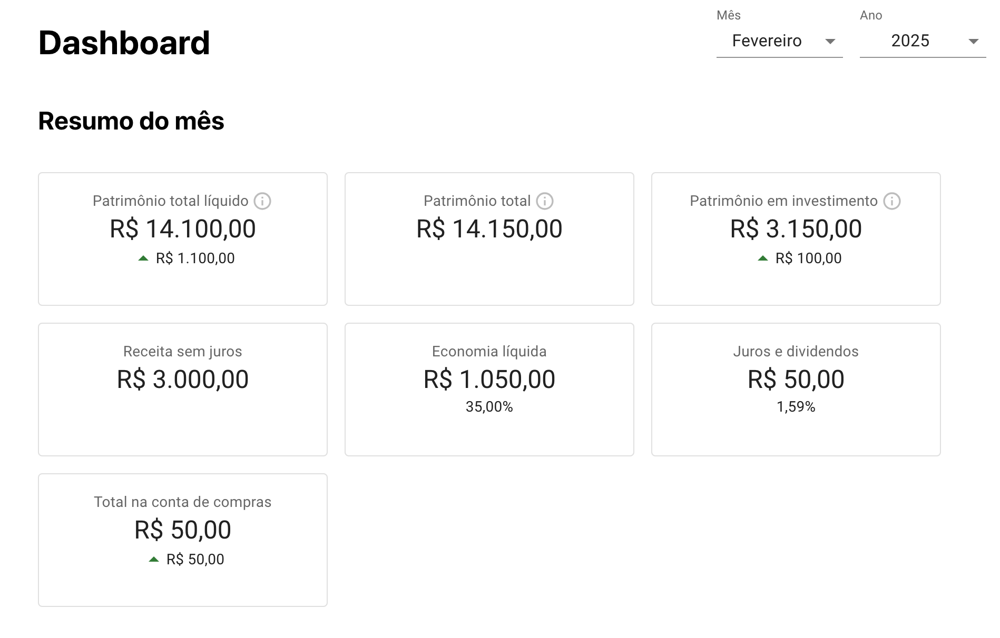

Agora, temos calculados alguns valores de economia e juros. Primeiramente, temos o valor de R$14100 como patrimônio total “líquido”. Esse valor é o nosso patrimônio total, calculado pela soma de todos os nossos patrimônios em todas as nossas contas, menos o valor que possuímos na nossa conta de compras, que agora possui um saldo de R$50, já que fizemos uma reserva nesse valor nesse mês.

Nosso patrimônio em investimento está em R$3150, mas a informação abaixo desse valor indica um crescimento de apenas R$100, embora nossa diferença para o mês anterior foi de R$150. Isso acontece porque esse crescimento na verdade é o valor novo que foi depositado em nossas contas de investimento. Perceba que R$50 desse valor foi atribuído a Juros e dividendos. Claro, se antes possuíamos um valor de 3000 nessa conta, e agora possuímos um valor de 3150, mas durante o mês nós só depositamos o valor de R$100, esse valor extra de R$50 a aplicação automaticamente identifica como um crescimento passivo e atribui a Juros e dividendos. O cálculo de 1,59% é basicamente o valor aproximado de R$50 dividido por R$3150.

Nossas receitas sem juros permanecem em R$3000, que foi nosso salário cadastrado, mas agora temos um cálculo de economia líquida, que foi de R$1050. Perceba que tivemos um aumento de patrimônio líquido de R$1100, mas, como visto anteriormente, tivemos um ganho passivo de R$50. O valor da economia é calculado como o valor total de aumento de patrimônio líquido, menos o valor de Juros e dividendos. O valor de 35% é calculado como a divisão entre nossa Economia líquida e nossa Receita sem juros.

Pronto, conseguimos calcular a contabilidade dos nossos meses de Janeiro e Fevereiro de 2025, e podemos verificar se batemos nossa meta de economia.

# Próximos passos

Como próximo passo, eu sugiro você mesmo usar a aplicação para cadastrar suas finanças. Além disso, eu recomendo ler o artigo que explica os conceitos principais da aplicação para entender melhor sobre o que cada coisa significa, disponível [aqui](https://lucasmaia.dev/post/meu-bolso-principais-conceitos).

Caso ainda tenha dúvida em algum conceito, mesmo lendo nosso artigo completo, deixe um comentário para que eu possa pessoalmente ajudar, ou talvez a própria comunidade vá ao seu auxílio.

Se perceber algum tipo de comportamento inesperado, pode ser que isso seja uma falha da aplicação. Você pode me ajudar reportando esses problemas nos comentários para que eu possa analisar assim que possível. Nesses casos, capturas de tela podem ser muito valiosas, apesar delas não poderem ser anexadas nos comentários.

Obrigado e boas economias!

# Imagem de capa

A foto de capa é de [Mike Hindle](https://unsplash.com/@mikehindle) e está disponível no [Unsplash](https://unsplash.com/photos/a-black-and-white-photo-of-a-circular-window-ppkTc8mp8ZE)